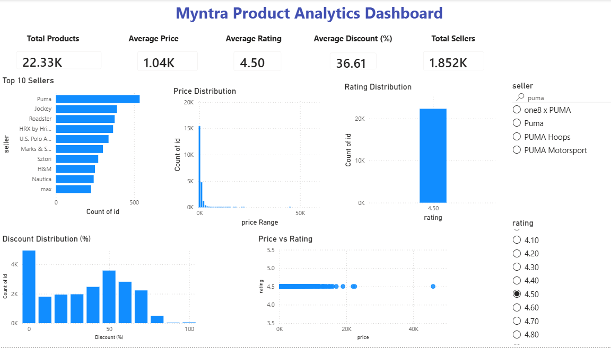

# Myntra Product Analytics Dashboard

## Project Overview
This project analyzes Myntra product data using R, SQL, and Power BI to uncover pricing trends, seller performance, customer ratings, and discount patterns.

## Tools & Technologies
- R
- SQL (MySQL)
- Power BI
- Excel

## Project Features
- Data Cleaning using R
- SQL Business Analysis
- Interactive Power BI Dashboard
- Data Visualization
- Business Insights

## Dashboard Preview



## Key Metrics
- Total Products: 252,809
- Average Price: ₹1.01K
- Average Rating: 4.16
- Average Discount: 42.04%
- Total Sellers: 3,581

## Dashboard Insights
- Top 10 Sellers by Product Count
- Price Distribution
- Rating Distribution
- Discount Distribution
- Price vs Rating Analysis

## Power BI Dashboard

An interactive dashboard was developed in **Power BI** to visualize key business metrics.

### Dashboard Features

- KPI Cards
  - Total Products
  - Average Price
  - Average Rating
  - Average Discount
  - Total Sellers

- Visualizations
  - Top 10 Sellers
  - Price Distribution
  - Rating Distribution
  - Discount Distribution
  - Price vs Rating Scatter Plot

- Interactive Filters (Slicers)
  - Seller
  - Rating

> **Note:** The Power BI (.pbix) file is not included because it exceeds GitHub's upload size limit. A dashboard preview is provided below.

## Repository Structure
```
outputs/
scripts/
Dashboard.png
README.md
```
## Business Insights
- Most products have ratings above 4.
- Average discount is around 42%.
- Product prices are concentrated in the lower price range.
- A few sellers contribute a large share of products.

## Author
Avantika Gupta
